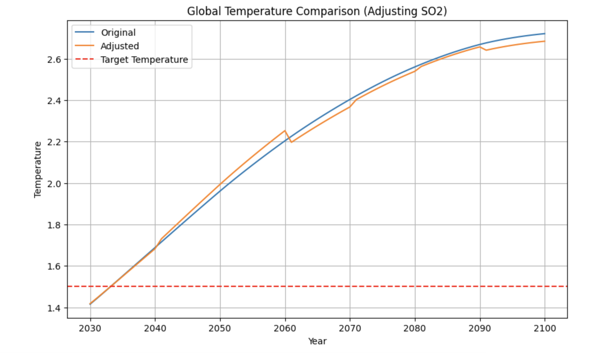

Geoengineering to Stabilize temperature levels

# i might need a more catchy/engaging starter paragraph but i'm not sure how

In the face of global climate change, innovative solutions are more important
than ever. One promising approach is geoengineering, specifically using aerosols
to stabilize global temperatures. This blog post explores my experiment, where I
aim to simulate how varying levels of aerosol injections might impact the
climate.

To clarify, this is purely an experiment – I'm not proposing to interfere with
existing policies, nor do I believe dumping harmful aerosols into the atmosphere
is inherently a good idea. Instead, this project aims to explore how this
concept functions from a scientific perspective. am Here's an outline of my
approach:

1. Climate Model: I'll select a robust climate model capable of simulating
   stratospheric interactions, particularly with aerosols.

2. Integration: This model will serve as a wrapper, allowing me to integrate it
   with an agent that can dynamically adjust aerosol levels.

3. Reinforcement Learning: I'll use RL optimization to analyze how these
   adjustments influence global temperature levels.

Now, you might wonder: Why frame this as a reinforcement learning problem?
Here's why:

1. Iterative Learning: The complex and dynamic nature of climate systems
   requires an iterative learning approach. RL allows the agent to explore and
   adapt, learning from its interactions with the model.

2. Policy Optimization: RL provides a pathway for finding an optimal strategy,
   balancing immediate rewards (temperature stabilization) with long-term goals.

3. Exploration vs. Exploitation:The balance between trying new approaches and
   leveraging known successful ones is crucial, and RL manages this balance
   effectively.

This experiment aims to offer insights into how geoengineering strategies can
impact climate, potentially contributing to broader conversations about managing
climate change.

So… Let's Begin!

To find a suitable climate model, I explored various General Circulation Models
(GCMs) and Simple Climate Models (SCMs) commonly used by climate scientists.
However, I needed something simple that could run on my PC, given its limited
computational power. I stumbled upon Hector, a compact climate model written in
C++【TODO: insert link】, with a Python interface (PyHector) that's a perfect
fit for my project.

Hector offers key functionalities such as simulating temperature responses to
aerosol injections, with variables including SO2 emissions, CO2 levels, and
global temperatures. This makes it particularly useful for exploring how aerosol
levels affect climate. _TODO maybe ill add the col names in bold_

I conducted an initial experiment, increasing SO2 levels in 2030 by 1000 times,
leading to a drastic drop in temperature to -25°C. Well, that's one way to
tackle climate change—by freezing everything out!

After manually experimenting with different well studied aerosols and its
effects on overall temperature, I decided to proceed with Hector for further
experiments. My next steps involved manually exploring the effects of various
aerosols on temperature using PyHector.

Updated Plan:

1. Agent for SO2: I created an agent to adjust SO2 levels dynamically.

2. Expand Aerosol Types: If the agent performs well, I'll introduce more
   aerosols for comprehensive adjustments.

3. Geographic Specificity: Further, I'll explore how these changes can be
   applied to specific geographic locations (latitude and longitude).

Armed with this plan, I set off to explore how this approach can stabilize
global temperatures.

Code Implementation

I integrated the climate model with a reinforcement learning (RL) agent using
the Proximal Policy Optimization (PPO) algorithm. Here's how the implementation
works:

1. Model Setup: The Hector model is used to simulate climate dynamics. This
   model's Python interface provides functions to modify variables like SO2
   emissions, which directly impact global temperature levels.

   ```python
   def update_so2(ssp, values):
       ssp2 = ssp.copy()
       for year, value in values:
           ssp2.loc[year, 'SO2_emissions'] = value
       return ssp2
   ```

   - The `update_so2` function allows for altering emissions data, supporting
     dynamic adjustments by the RL agent.

2. Policy and Value Networks: I defined two neural networks: one for the RL
   agent's policy, and another for valuing states.

   - Policy Network: A 3-layer network that outputs a mean and standard
     deviation for actions. This helps the agent choose appropriate SO2 levels
     dynamically.

     ```python
     class PolicyNetwork(nn.Module):
         def __init__(self, state_dim, action_dim):
             super(PolicyNetwork, self).__init__()
             self.fc1 = nn.Linear(state_dim, 128)
             self.fc2 = nn.Linear(128, 128)
             self.fc3 = nn.Linear(128, 64)
             self.fc_mean = nn.Linear(64, action_dim)
             self.fc_std = nn.Linear(64, action_dim)
         def forward(self, x):
             x = torch.relu(self.fc1(x))
             x = torch.relu(self.fc2(x))
             x = torch.relu(self.fc3(x))
             mean = self.fc_mean(x)
             std = torch.exp(self.fc_std(x)) + 1e-8
             return mean, std
     ```

   - Value Network: A 3-layer network that estimates the value of the current
     state, guiding the agent's learning.

     ```python
     class ValueNetwork(nn.Module):
         def __init__(self, state_dim):
             super(ValueNetwork, self).__init__()
             self.fc1 = nn.Linear(state_dim, 128)
             self.fc2 = nn.Linear(128, 128)
             self.fc3 = nn.Linear(128, 1)
         def forward(self, x):
             x = torch.relu(self.fc1(x))
             x = torch.relu(self.fc2(x))
             x = self.fc3(x)
             return x
     ```

3. Training the Agent: I implemented a training loop where the agent selects
   actions, modifies emissions, and runs the Hector model to observe the effects

   ```python
   def train_policy(ssp245):
       for epoch in range(num_epochs):
           state = torch.tensor([2030, ssp245.loc[2030, 'SO2_emissions']], dtype=torch.float32)
           rewards, log_probs, values = [], [], []

           print(f"Epoch [{epoch+1}/{num_epochs}]")
           for t in range(max_timesteps):
               if state[0].item() > 2100:
                   break
               mean, std = policy_net(state)
               dist = Normal(mean, std)
               action = dist.sample()
               log_prob = dist.log_prob(action)
               adjusted_so2 = update_so2(ssp245, [(state[0].item(), action.item())])
               temp_diff = run_model(ssp245, adjusted_so2, state[0].item())
               reward = compute_reward(temp_diff)
               next_year = state[0].item() + 1

               if next_year <= 2100:
                   next_state = torch.tensor([next_year, adjusted_so2.loc[next_year, 'SO2_emissions']], dtype=torch.float32)
               else:
                   break

               rewards.append(reward)
               log_probs.append(log_prob)
               values.append(value_net(state))
               state = next_state

           returns = []
           R = 0
           for r in reversed(rewards):
               R = r + gamma * R
               returns.insert(0, R)
           returns = torch.tensor(returns, dtype=torch.float32)
           advantages = (returns - torch.cat(values)).detach()

           policy_loss = (-torch.cat(log_probs) * advantages).mean()
           value_loss = nn.MSELoss()(torch.cat(values), returns)

           policy_optimizer.zero_grad()
           value_optimizer.zero_grad()

           total_loss = policy_loss + value_loss
           total_loss.backward()

           torch.nn.utils.clip_grad_norm_(policy_net.parameters(), max_norm=0.5)
           torch.nn.utils.clip_grad_norm_(value_net.parameters(), max_norm=0.5)

           policy_optimizer.step()
           value_optimizer.step()

           print(f"Epoch [{epoch+1}/{num_epochs}] - Total Loss: {total_loss.item():.4f}")
   ```

4. Initialization:

   - The training process starts by setting hyperparameters, such as learning
     rate, discount factor (`gamma`), clipping threshold, and number of epochs.

   - Policy and value networks are created, with optimizers initialized for
     each, using the Adam algorithm.

5. Epochs and Timesteps:

   - The training loop runs for a specified number of epochs, with each epoch
     containing multiple timesteps.

   - At each timestep, the agent selects an action based on the current state,
     updates the climate model, and observes the resulting changes.

6. State and Action Selection

   - State Representation: The state is represented as a tensor containing the
     year and SO2 emissions data.

   - Policy Network: This state is fed into the policy network, producing a mean
     and standard deviation for actions, which are sampled from a Normal
     distribution.

7. Climate Model Update:

   - The selected action updates SO2 emissions, and the Hector model is run to
     compute temperature levels.

   - The resulting temperature difference from a baseline serves as feedback for
     the agent.

8. Reward and Returns:

   - The reward is computed based on how closely the temperature difference
     aligns with a target.

   - Rewards are converted into returns, discounted by the `gamma` factor.

9. PPO Optimization

   - Advantages:Advantages are computed as the difference between returns and
     the value network's estimates.

   - Losses: Policy and value losses are calculated, combining them into a total
     loss.

   - Clipping:Gradients are clipped, and both networks are updated through
     backpropagation.

10. Evaluation: The trained agent is evaluated by having it dynamically adjust
    emissions and observing temperature changes:

    ```python
    def evaluate_policy(ssp245):
        state = torch.tensor([2030, ssp245.loc[2030, 'SO2_emissions']], dtype=torch.float32)
        temps = []
        for t in range(max_timesteps):
            if state[0].item() > 2100:
                break
            with torch.no_grad():
                mean, _ = policy_net(state)
                action = mean.item()

            adjusted_so2 = update_so2(ssp245, [(state[0].item(), action)])
            temp_diff = run_model(ssp245, adjusted_so2, state[0].item())
            temps.append(temp_diff)
            next_year = state[0].item() + 1

            if next_year <= 2100:
                next_state = torch.tensor([next_year, adjusted_so2.loc[next_year, 'SO2_emissions']], dtype=torch.float32)
            else:
                break

            state = next_state
        return temps
    ```

11. Visualization:Temperature responses are plotted against time, showcasing the
    agent's effectiveness in adjusting emissions.

After training it for nearly 10,000 episodes, I was able to see a slight
decrease in overall climate, but _describe why it wasn’t as efficient TODO:
maybe related to reward function and overfitting_

Part 2: Expanding the Agent to Control Multiple Aerosols

Having established a foundation for managing SO2 emissions, I expanded the
agent's capabilities by allowing it to control multiple aerosols simultaneously.
Here's how this new implementation builds upon the initial setup:

1. Model Setup: The Hector model continues to serve as the core climate
   simulation, with an updated function for handling multiple aerosols:

   ```python
   def update_aerosols(ssp, aerosols, values):
       ssp2 = ssp.copy()
       for aerosol, (year, value) in zip(aerosols, values):
           ssp2.loc[year, f'{aerosol}_emissions'] = value
       return ssp2
   ```

   - This function updates emissions data for multiple aerosols, including SO2,
     black carbon (BC), and organic carbon (OC).

2. Action Space: The action space accommodates multiple aerosols, with the
   policy network producing a vector of actions:

   ```python
   action_dim = len(aerosols)  # Number of aerosols being controlled
   ```

3. Training Loop:

   ```python
   def train_policy(ssp245, aerosols):
       for epoch in range num_epochs:
           state = torch.tensor([2030] + [ssp245.loc[2030, f'{aerosol}_emissions'] for aerosol in aerosols], dtype=torch.float32)
           rewards, log_probs, values = [], [], []
           print(f"Epoch [{epoch+1}/{num_epochs}]")

           for t in range max_timesteps:
               if state[0].item() > 2100:
                   break

               mean, std = policy_net(state)
               dist = Normal(mean, std)
               action = dist.sample()
               log_prob = dist.log_prob(action)

               adjusted_aerosols = {aerosol: action[i].item() for i, aerosol in enumerate(aerosols)}
               temp_diff = run_model(ssp245, adjusted_aerosols, state[0].item())
               reward = compute_reward(temp_diff)

               next_year = state[0].item() + 1
               if next_year <= 2100:
                   next_state = torch.tensor([next_year] + [ssp245.loc[next_year, f'{aerosol}_emissions'] for aerosol in aerosols], dtype=torch.float32)
               else:
                   break

               rewards.append(reward)
               log_probs.append(log_prob)
               values.append(value_net(state))

               state = next_state
   ```

   - State Representation: The state is now a tensor consisting of the year and
     emissions data for each aerosol.

   - Action Selection: The policy network outputs a mean and standard deviation
     for each aerosol's emissions, which are sampled from a Normal distribution.

   - Returns and Advantages: Rewards collected over timesteps are converted into
     returns, iteratively discounted by the `gamma` factor. Advantages are
     computed as the difference between returns and value network estimates.

4. PPO Optimization:

   - Losses:Policy loss is calculated as the mean product of advantages and
     negative log probabilities of actions. Value loss is computed as the mean
     squared error between value network outputs and returns.

   - Clipping: Gradients for both networks are clipped to avoid excessive
     updates, ensuring training stability.

   - Gradient Descent:Total loss (policy + value) is backpropagated, and both
     networks are updated using their respective optimizers.

#add graph for showing the changes - unforch this doesnt change much

Next: geographic visualization

## add pics



